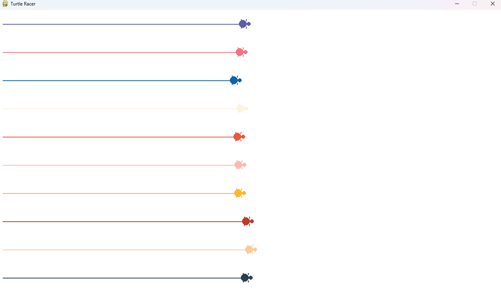

# Turtle Racer Game

<p>
    
    
</p>

Turtle Racer is a simple, engaging game developed using Python and Pygame. It features a race between colorful turtles, where each turtle moves randomly, and the excitement builds as they approach the finish line!



## Features

- A race simulation with multiple turtles.
- Each turtle has a unique color from an aesthetically pleasing sunset palette.
- The game can be restarted with a simple mouse click.
- Easy-to-follow UI and straightforward gameplay.

## Getting Started

### Prerequisites

Before you begin, ensure you have the following installed:

- Python 3.9
- Pygame library

You can install Pygame using pip:

```bash
pip install pygame
```

## Installation

- Clone the repository or download the source code.
- Navigate to the directory containing the game files.
- Run the game using Python:

```bash
python app.py
```

## Usage

- Once the game starts, turtles will be positioned at the start line.
- Click anywhere to start the race.
- The winner is the first turtle to reach the right side of the window.
- To restart the race, simply click the mouse again.

## License

Distributed under the MIT License. See LICENSE for more information.
